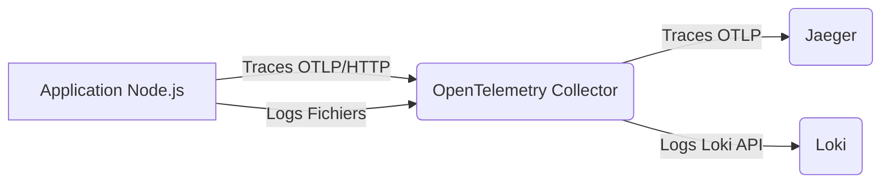

# PM2 + OpenTelemetry Lab (Traces non-intrusives pour Node.js)

## Intention du Projet

Ce projet est un bac à sable conçu pour démontrer et tester la mise en œuvre d'OpenTelemetry (OTel) dans une application Node.js existante, en particulier lorsqu'elle est exécutée avec PM2 en mode cluster. L'objectif principal est d'atteindre une **instrumentation non-intrusive**, c'est-à-dire sans modifier le code source de l'application métier elle-même.

Le projet inclut :
*   Une application Node.js minimale simulant une application existante.
*   Une configuration Docker pour conteneuriser l'application.
*   Une stack d'observabilité complète avec Docker Compose, comprenant :
    *   **Jaeger :** Pour la visualisation des traces distribuées.
    *   **Loki :** Pour l'agrégation et la recherche de logs.
    *   **Grafana :** Pour la visualisation des logs et des métriques (via Loki).
    *   **OpenTelemetry Collector :** Le composant central pour la réception, le traitement et l'exportation des données de télémétrie (traces et logs).

## Fonctionnement Détaillé

L'approche adoptée ici permet d'injecter l'instrumentation OpenTelemetry au démarrage de l'application, sans que l'application n'ait connaissance d'OpenTelemetry.

### Architecture Générale

1.  **Application Node.js (`app/index.js`) :** C'est l'application métier. Elle est volontairement simple et ne contient aucune ligne de code liée à OpenTelemetry (à l'exception d'une utilisation optionnelle de l'API `trace` pour des spans personnalisés, mais l'auto-instrumentation fonctionnerait sans cela).
2.  **PM2 (`ecosystem.config.cjs`) :** PM2 est utilisé pour gérer le processus Node.js en mode cluster. C'est lui qui va "amorcer" OpenTelemetry.
3.  **Script de Bootstrap OpenTelemetry (`otel/tracing.cjs`) :** Ce fichier contient toute la logique d'initialisation du SDK OpenTelemetry, des auto-instrumentations et de la configuration de l'exportateur de traces. Il est délibérément placé en dehors du répertoire de l'application (`app/`) pour renforcer la séparation.
4.  **OpenTelemetry Collector (`otel-collector-config.yaml`) :** Le collecteur reçoit les traces de l'application via OTLP/HTTP et les logs via la lecture de fichiers (`filelog`). Il exporte ensuite les traces vers Jaeger et les logs vers Loki.
5.  **Jaeger, Loki, Grafana :** Ces outils sont les destinations finales pour la visualisation des données de télémétrie.

### Architecture d'Observabilité

Voici un schéma des flux de traces et de logs entre les différents composants :



### Rôle de `ecosystem.config.cjs`

Le fichier `app/ecosystem.config.cjs` est la clé de l'instrumentation non-intrusive. Dans la section `apps`, l'option `node_args` est utilisée :

```javascript
      node_args: ['--require', '/opt/otel/tracing.cjs']
```

*   `--require` est une option de Node.js qui permet de précharger un module avant l'exécution du code de l'application principale.
*   `/opt/otel/tracing.cjs` est le chemin absolu vers notre script de bootstrap OpenTelemetry à l'intérieur du conteneur Docker.

Ainsi, avant même que `index.js` ne commence à s'exécuter, le SDK OpenTelemetry est initialisé et les auto-instrumentations sont activées. Cela signifie que toutes les requêtes HTTP, les appels de base de données, etc., seront automatiquement tracés sans modifier le code de l'application.

De plus, ce fichier configure les variables d'environnement nécessaires au SDK OpenTelemetry, telles que `OTEL_SERVICE_NAME` et `OTEL_EXPORTER_OTLP_ENDPOINT`.

### Rôle de `otel/tracing.cjs`

Ce script est le point d'entrée de l'instrumentation OpenTelemetry. Il effectue les actions suivantes :

1.  **Importe les dépendances nécessaires :** `NodeSDK`, `getNodeAutoInstrumentations`, `Resource`, `SemanticResourceAttributes`, et surtout `OTLPTraceExporter` pour l'exportation HTTP.
2.  **Configure l'exportateur de traces :** Il instancie explicitement `OTLPTraceExporter` en lui fournissant l'URL du collecteur OpenTelemetry (`http://otel-collector:4318/v1/traces`). Cette configuration explicite garantit que le SDK utilise le protocole HTTP, évitant ainsi les problèmes de détection automatique.
3.  **Définit les auto-instrumentations :** `getNodeAutoInstrumentations()` détecte et instrumente automatiquement les bibliothèques Node.js courantes (Express, HTTP, etc.). Une exclusion pour `fs` est ajoutée pour réduire le bruit.
4.  **Crée une ressource :** La ressource contient des informations sur le service (ici, `demo-node`), essentielles pour identifier les traces dans Jaeger.
5.  **Initialise le SDK :** `new NodeSDK({...})` crée une instance du SDK OpenTelemetry en lui passant la ressource, l'exportateur de traces configuré et les instrumentations.
6.  **Démarre le SDK :** `sdk.start()` active l'instrumentation.
7.  **Gère l'arrêt propre :** Des écouteurs d'événements `SIGTERM` et `SIGINT` sont mis en place pour s'assurer que le SDK s'arrête proprement lors de l'arrêt du processus, garantissant que toutes les traces en attente sont exportées.

## Comment Lancer l'Application

1.  **Construire et démarrer les conteneurs :**
    ```bash
    docker compose up -d --build
    ```
    Cette commande va construire l'image Docker de l'application, puis démarrer tous les services définis dans `docker-compose.yml` en arrière-plan.

2.  **Générer du trafic :**
    Envoyez des requêtes à l'application pour générer des traces et des logs.
    ```bash
    curl http://localhost:3000/
    curl http://localhost:3000/work
    ```

## Comment Observer les Résultats

Une fois le trafic généré, vous pouvez accéder aux interfaces d'observabilité :

*   **Jaeger (Traces) :**
    *   Ouvrez votre navigateur à l'adresse : [http://localhost:16686](http://localhost:16686)
    *   Dans l'interface Jaeger, sélectionnez `demo-node` dans le menu déroulant "Service".
    *   Cliquez sur "Find Traces". Vous devriez voir les traces correspondant à vos requêtes `/` et `/work`.

*   **Grafana (Logs) :**
    *   Ouvrez votre navigateur à l'adresse : [http://localhost:3001](http://localhost:3001)
    *   Connectez-vous (identifiants par défaut : `admin`/`admin`).
    *   Dans le menu de gauche, allez dans "Explore" (l'icône de la boussole).
    *   Sélectionnez la source de données `Loki`.
    *   Utilisez les requêtes suivantes pour explorer les logs :
        *   Logs de l'application : `{job="app-logs"}`
        *   Logs de PM2 : `{job="pm2-logs"}`
        *   Logs liés au service `demo-node` : `{service_name="demo-node"}`

Ce setup permet d'expérimenter l'observabilité sans modifier le code de l'application existante.